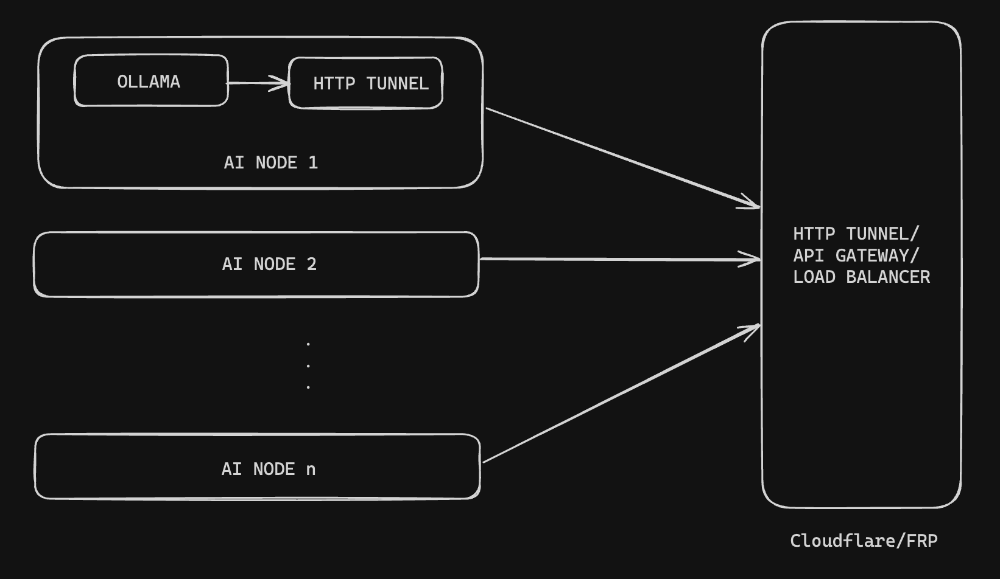

## Architecture



## Install Ollama

Install Ollama in Linux or WSL2

```
curl -fsSL https://ollama.com/install.sh | sh
```

## Start Ollama

To run and chat with [Llama 3.1](https://ollama.com/library/llama3.1):

```
ollama run llama3.1
```

## Signup for token

TODO: Admin panel signup...

## Setup cloudflared

```
curl -L --output cloudflared.deb https://github.com/cloudflare/cloudflared/releases/latest/download/cloudflared-linux-amd64.deb &&  sudo dpkg -i cloudflared.deb &&  sudo cloudflared service install eyJhIjoiZm...<token>
```
